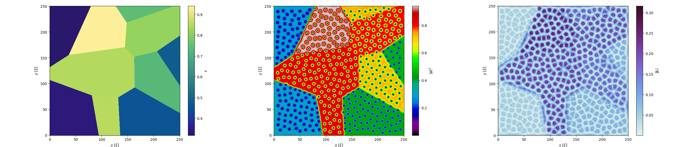

# Examples and use cases

Each example should have prefix `example_`. `run_examples.sh` runs all examples.

## User-defined geometry

`example_geometry.py` shows use case of user-defined geometry of superconductor. It produces the following image.

## Linear coefficient

`example_linear_coefficient.py` shows sparial variations in linear coefficient.

## GL plotter

`example_plotter.py` demonstrates capabilities of simple build-in plotter.

